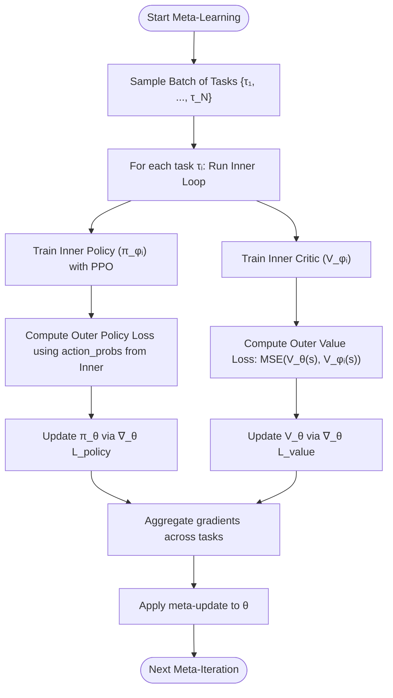
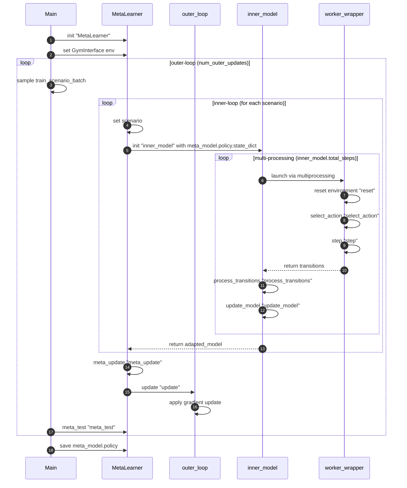

```mermaid
flowchart TD

%% Task-level Meta-Learning Loop
Start(["Start Meta-Learning"]) --> SampleTasks["Sample Batch of Tasks {τ₁, ..., τ_N}"]

%% Inner Loop
SampleTasks --> InnerLoop["For each task τᵢ: Run Inner Loop"]
InnerLoop --> InnerPolicy["Train Inner Policy (π_φᵢ) with PPO"]
InnerLoop --> InnerValue["Train Inner Critic (V_φᵢ)"]

%% Outer Loop
InnerPolicy --> PolicyLoss["Compute Outer Policy Loss using action_probs from Inner"]
InnerValue --> ValueLoss["Compute Outer Value Loss: MSE(V_θ(s), V_φᵢ(s))"]

PolicyLoss --> UpdatePolicy["Update π_θ via ∇_θ L_policy"]
ValueLoss --> UpdateValue["Update V_θ via ∇_θ L_value"]

UpdatePolicy --> Merge["Aggregate gradients across tasks"]
UpdateValue --> Merge

Merge --> UpdateParams["Apply meta-update to θ"]

UpdateParams --> End(["Next Meta-Iteration"])
```

```mermaid
sequenceDiagram
    autonumber
    participant Main
    participant MetaLearner
    participant outer_loop
    participant inner_model
    participant worker_wrapper

    Main->>MetaLearner: init "MetaLearner"
    Main->>MetaLearner: set GymInterface env

    loop outer-loop (num_outer_updates)
        Main->>Main: sample train_scenario_batch

        loop inner-loop (for each scenario)
            MetaLearner->>MetaLearner: set scenario
            MetaLearner->>inner_model: init "inner_model" with meta_model.policy.state_dict

            loop multi-processing (inner_model.total_steps)
                inner_model->>worker_wrapper: launch via multiprocessing
                worker_wrapper->>worker_wrapper: reset environment "reset"
                worker_wrapper->>worker_wrapper: select_action "select_action"
                worker_wrapper->>worker_wrapper: step "step"
                worker_wrapper-->>inner_model: return transitions
                inner_model->>inner_model: process_transitions "process_transitions"
                inner_model->>inner_model: update_model "update_model"
            end

            inner_model-->>MetaLearner: return adapted_model
        end

        MetaLearner->>MetaLearner: meta_update "meta_update"
        MetaLearner->>outer_loop: update "update"
        outer_loop->>outer_loop: apply gradient update

        Main->>MetaLearner: meta_test "meta_test"
    end

    Main->>MetaLearner: save meta_model.policy
```
