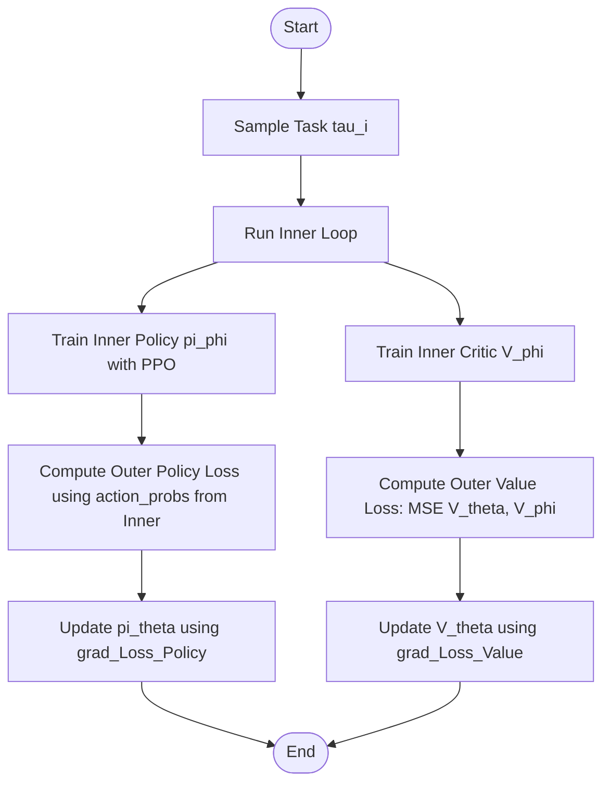

```mermaid
flowchart TD

Start([Start]) --> SampleTask[Sample Task tau_i]
SampleTask --> InnerLoop[Run Inner Loop]
InnerLoop --> TrainPolicy[Train Inner Policy pi_phi with PPO]
InnerLoop --> TrainValue[Train Inner Critic V_phi]

TrainPolicy --> ComputePolicyLoss[Compute Outer Policy Loss using action_probs from Inner]
TrainValue --> ComputeValueLoss[Compute Outer Value Loss: MSE V_theta, V_phi]

ComputePolicyLoss --> UpdatePolicy[Update pi_theta using grad_Loss_Policy]
ComputeValueLoss --> UpdateValue[Update V_theta using grad_Loss_Value]

UpdatePolicy --> End([End])
UpdateValue --> End
```
