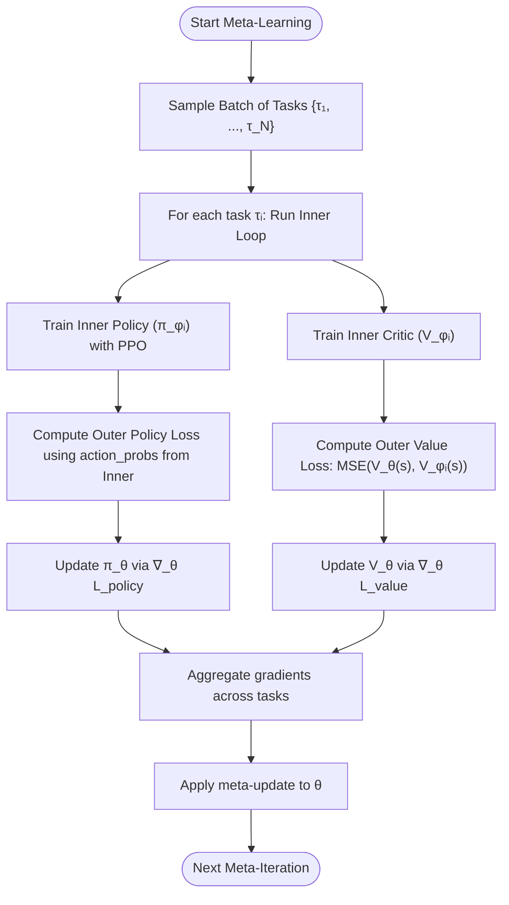

```mermaid
flowchart TD

%% Task-level Meta-Learning Loop
Start(["Start Meta-Learning"]) --> SampleTasks["Sample Batch of Tasks {τ₁, ..., τ_N}"]

%% Inner Loop
SampleTasks --> InnerLoop["For each task τᵢ: Run Inner Loop"]
InnerLoop --> InnerPolicy["Train Inner Policy (π_φᵢ) with PPO"]
InnerLoop --> InnerValue["Train Inner Critic (V_φᵢ)"]

%% Outer Loop
InnerPolicy --> PolicyLoss["Compute Outer Policy Loss using action_probs from Inner"]
InnerValue --> ValueLoss["Compute Outer Value Loss: MSE(V_θ(s), V_φᵢ(s))"]

PolicyLoss --> UpdatePolicy["Update π_θ via ∇_θ L_policy"]
ValueLoss --> UpdateValue["Update V_θ via ∇_θ L_value"]

UpdatePolicy --> Merge["Aggregate gradients across tasks"]
UpdateValue --> Merge

Merge --> UpdateParams["Apply meta-update to θ"]

UpdateParams --> End(["Next Meta-Iteration"])
```
